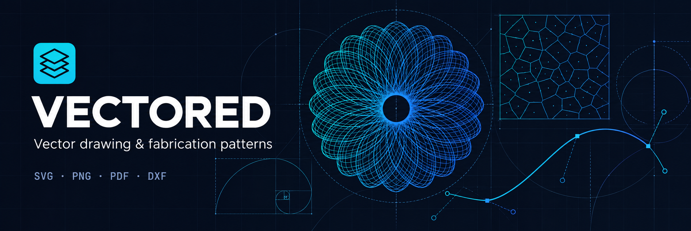

# Vectored

A vector drawing and fabrication pattern editor built with React, Vite, and Tauri 2. The desktop app bundles the editor into a native window; it does not need a browser, Node.js, or a running web server after installation.

## Development

Install Node.js 22 LTS or newer, Rust stable, and the [Tauri prerequisites](https://v2.tauri.app/start/prerequisites/) for your operating system:

- macOS: Xcode command line tools (`xcode-select --install`).
- Windows: Visual Studio C++ Build Tools and Microsoft Edge WebView2.
- Linux: WebKitGTK 4.1 and the distribution's development libraries listed in the Tauri guide.

```sh
npm ci
npm run desktop:dev
```

Tauri starts Vite on `127.0.0.1:3000` and opens the native app. That port must be available. Frontend edits reload automatically; Rust edits rebuild the shell.

To run only the web editor:

```sh
npm run dev
```

## Build installers

```sh
npm run desktop:build
```

The output is under `src-tauri/target/release/bundle/`:

| Build host | Outputs |
| --- | --- |
| macOS | `.app` and `.dmg` |
| Windows | MSI and NSIS installers |
| Linux | Debian, RPM, and AppImage packages |

Build each operating system's installers on that operating system. For a macOS app bundle without a disk image, use `npm run desktop:build -- --bundles app`. For a universal Mac build, install both Rust Mac targets and run:

```sh
rustup target add aarch64-apple-darwin x86_64-apple-darwin
npm run desktop:build -- --target universal-apple-darwin
```

The **Desktop builds** GitHub Actions workflow runs checks and produces downloadable installer artifacts for Apple Silicon, Intel Mac, Windows x64, and Linux x64. It runs on pull requests or manually from Actions. It does not publish releases. These are unsigned development builds; configure [macOS signing/notarization](https://v2.tauri.app/distribute/sign/macos/) and [Windows signing](https://v2.tauri.app/distribute/sign/windows/) before distributing trusted public installers. Choose your permanent bundle identifier in `src-tauri/tauri.conf.json` before the first public release.

## Desktop behavior

- Open and save `.json` projects using native system dialogs. Existing browser project files remain compatible.
- Save SVG, PNG, PDF, and DXF exports to a chosen location.
- Canceling a save keeps the current project and its save/export dialog open. A failed write reports the error and does not continue “save and new.”
- Use Ctrl on Windows/Linux or Command on macOS with N/O/S/E/I for New/Open/Save/Export/Import SVG. Existing editing shortcuts remain available.
- Image/SVG inputs and canvas file drops use the webview's file handling. Tauri's separate drag-and-drop interception is disabled to preserve the editor's existing drop handlers.
- Styles, D3, worker scripts, and the Inter/JetBrains Mono interface fonts are bundled locally. Drawing, patterns, project files, and exports work offline with local assets and system fonts. Optional Google Fonts in artwork and remotely linked images still require internet access; unavailable fonts fall back to installed fonts. Imported embedded fonts/images remain part of the project.

Native filesystem access is limited to files selected in the Open/Save dialogs. The app does not grant general home-directory or shell access. The browser build continues to use ordinary downloads.

The bundle uses Paper.js Core for geometry; the unused PaperScript compiler is excluded so production can keep a Content Security Policy that disallows dynamic code evaluation. The development policy permits Vite's inline React refresh preamble.

## Checks

```sh
npm run lint
npm test
npm run build
npm run desktop:check
```

Use `package-lock.json` and `src-tauri/Cargo.lock` for reproducible builds. The older `bun.lock` predates the desktop setup; npm is the documented package manager. The frontend includes tests for native save cancellation, write errors, binary exports, Windows/macOS path handling, browser downloads, and the editor's geometry operations.

The Tauri setup follows its [Vite integration](https://v2.tauri.app/start/frontend/vite/), [dialog](https://v2.tauri.app/plugin/dialog/), and [filesystem](https://v2.tauri.app/plugin/file-system/) guides.

## License

Licensed under the [MIT License](LICENSE). Copyright © 2026 Colin Faulkingham.
